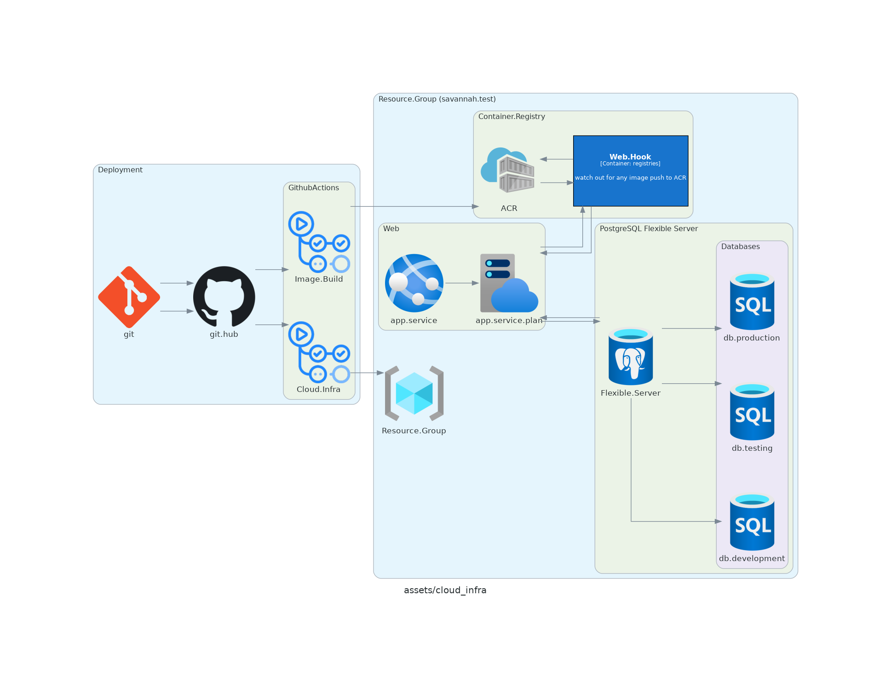
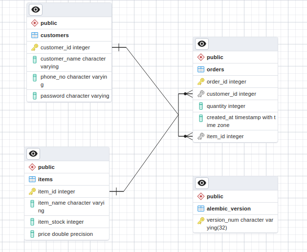
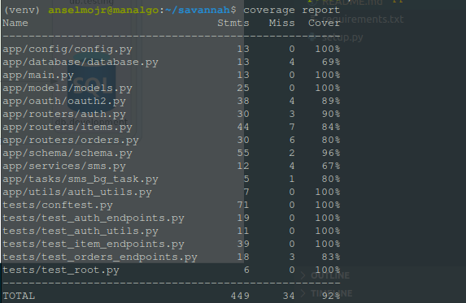

# Savannah.Backend.Challenge 

Backend Engineer (Junior) Test 
# Read The Docs 
## Read Using Swagger (Read & Test)
[https://savannah-api.azurewebsites.net/docs](https://savannah-api.azurewebsites.net/docs)

## Read Uisng Redocs (Read)
[https://savannah-api.azurewebsites.net/redoc](https://savannah-api.azurewebsites.net/redoc)

# Cloud Infrastructure  & Deployment 

## Resources 
- **Azure Container Registry:** 
Azure Container Registry is a private registry service for building, storing, and managing container images and related artifacts. In this quickstart, you create an Azure container registry instance with the Azure portal. 
- **App Service:** 
Azure App Service is an HTTP-based service for hosting web applications, REST APIs, and mobile back ends. You can develop in your favorite language. (used python)
- **App Service Plan:** 
An app service always runs in an App Service plan
- **PostgreSQL Flexible Server:**
Provides a managed PostgreSQL server that allows you to focus on using PostgreSQL, instead of focusing on managing your database server
- **Web Hook (For Registry):**
Used to trigger an automatic docker image pull once there is a new image push to container registry (ACR). It contributes to the aspect of CI/CD 

# DataBase Schema 


# Run Locally without Docker 
- create a virtual environement 
```bash 
python3 -m venv venv 
```
- Activate the virtual environment
```bash 
source venv/bin/activate
```

- Install required dependancies 
```bash 
pip install -r requirements.txt
```
- Then  run the command below 
```bash 
uvicorn app.main:app --reload 
```
# Run Locally with Docker 
```bash 
docker-compose -f docker-compose.dev.yaml up --build 
```

# Run Tests 
```bash 
pytest tests/ -v 

```
# check Code Coverage 
```bash 
coverage run -m pytest

coverage report 

```
## sample report 



# Tools & Technologies 
## lanuages and Frameworks 
- [FastApi (Python)](https://fastapi.tiangolo.com/) 
FastAPI is a modern, fast (high-performance), web framework for building **APIs** with Python 3.7+ based on standard Python type hints.
- [Bicep](https://learn.microsoft.com/en-us/azure/azure-resource-manager/bicep/overview?tabs=bicep)
Bicep is a **domain-specific language (DSL) For Infrastructure as Code**  that uses declarative syntax to **deploy Azure resources**. In a Bicep file, you define the infrastructure you want to deploy to Azure, and then use that file throughout the development lifecycle to repeatedly deploy your infrastructure. Your resources are deployed in a consistent manner.
- [Diagrams](https://diagrams.mingrammer.com/)
Diagrams lets you draw the **cloud system architecture** in Python code. It was born for **prototyping** a new system architecture without any design tools. You can also describe or visualize the existing system architecture as well.
Diagram as Code allows you to **track** the architecture **diagram** changes in any **version control system**.
## Database migration 
- [Alembic](https://alembic.sqlalchemy.org/en/latest/)
Alembic is a lightweight **database migration** tool for usage with the **SQLAlchemy** Database Toolkit for Python.
## ORM 
- [SQLAlchemy](https://www.sqlalchemy.org/)
SQLAlchemy is the Python SQL toolkit and **Object Relational Mapper** that gives application developers the full power and flexibility of SQL.
## Testing & Code Coverage 
- [pytest](https://docs.pytest.org/en/7.4.x/)
The pytest framework makes it easy to write small, readable tests, and can scale to support complex functional testing for applications and libraries.
- [coverage](https://coverage.readthedocs.io/en/7.3.1/)
Coverage measurement is typically used to gauge the effectiveness of tests. It can show which parts of your code are being exercised by tests, and which are not.

## CI/CD 
- [GithubAction](https://github.com/features/actions)
GitHub Actions makes it easy to automate all your software workflows, now with world-class CI/CD. Build, test, and deploy your code right from GitHub. Make code reviews, branch management.


